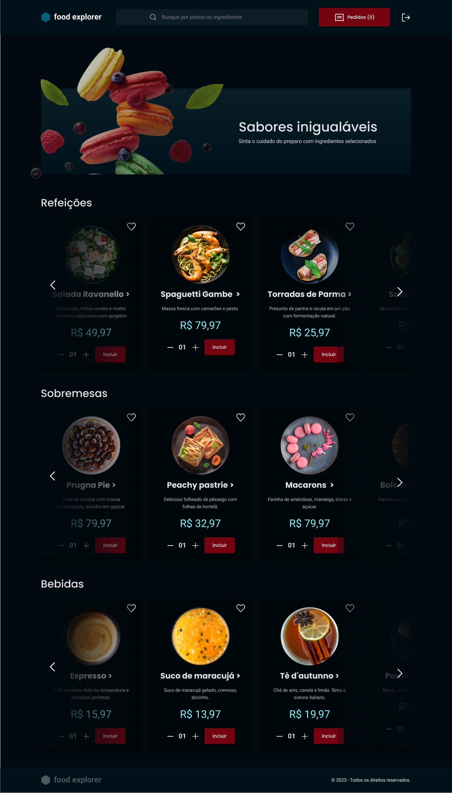
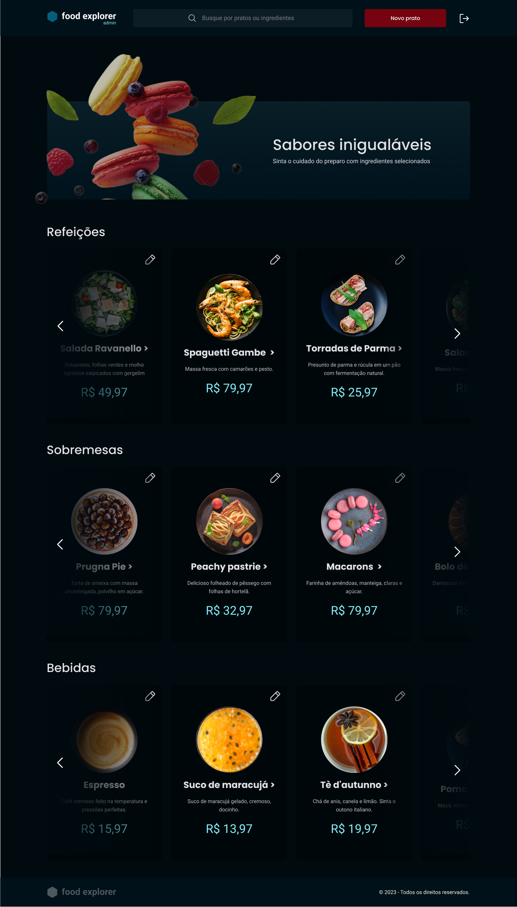
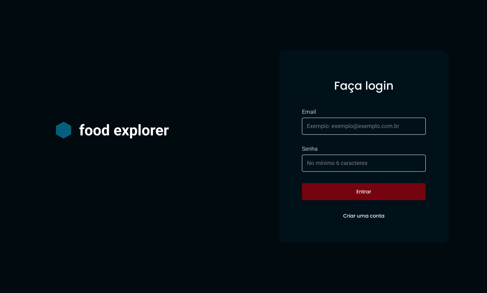
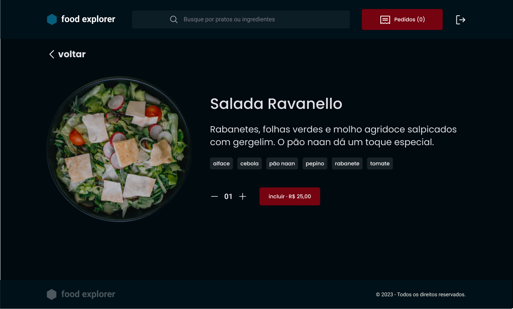

# React + Vite

This template provides a minimal setup to get React working in Vite with HMR and some ESLint rules.

Currently, two official plugins are available:

- [@vitejs/plugin-react](https://github.com/vitejs/vite-plugin-react/blob/main/packages/plugin-react/README.md) uses [Babel](https://babeljs.io/) for Fast Refresh
- [@vitejs/plugin-react-swc](https://github.com/vitejs/vite-plugin-react-swc) uses [SWC](https://swc.rs/) for Fast Refresh

# Food Explorer

This project is a robust web application designed to offer an interactive and intuitive experience to users. Built with a focus on usability and efficiency, the application encompasses a wide range of essential and advanced functionalities.
This project is a complete application for management and ordering in a restaurant, implementing functionalities for both administrators and end users

Tag Management: Facilitates the organization and categorization of content through a tag system, improving the navigability and relevance of search results.

Integration with External APIs: Leverages the power of external APIs to enrich the application with additional data and functionality, expanding capabilities beyond internal content.

Good Development Practices: Built following software development industry best practices and standards, including clean code, detailed documentation, and comprehensive testing.

## object

This React project uses Vite as its build tool and local development server, offering a fast and efficient development experience with Hot Module Replacement (HMR). The application incorporates several third-party libraries for additional functionality, including managing routes, HTTP requests, and component styling.







## Functionalities

Vite: Used as the development and build environment, Vite streamlines the development process with fast module reloading and simplified configuration compared to more traditional tools like Webpack.

React and React DOM: React is used as the core library to build the user interface, allowing the creation of reusable components and efficient management of application state. React DOM is used to render these components in the browser.

React Router DOM: Manages routes within the application, allowing navigation between different components without the need to reload the page, providing a more fluid and application-like user experience.

Axios: An HTTP client library based on Promises to make requests to external or internal APIs, facilitating data consumption and interaction with back-ends.

Lodash: Offers functional programming utilities to work with arrays, numbers, objects, strings, etc., in an easier and more concise way.

Styled-components: Used to write real CSS into JavaScript components, allowing direct styling of components within React code, which facilitates modularization and style maintenance.

React Icons: Provides popular icons as React components, allowing easy integration and customization of icons across the application.

React Loader Spinner: Offers loading spinner components to improve user experience while loading data or while waiting for asynchronous tasks to execute.

## Deploy

The API is hosted at [netlify](https://app.netlify.com/) and can be accessed through the following link:
[https://rocketfoodex.netlify.app] 

## technologies

🧠 React Icons

🤔 React Loader Spinner

😄 Styled-components

👩‍💻 Lodash

👯‍♀️ Vite

🤔 React Router DOM

🧠 JavaScript

🤔 Axios

😄 ESLint

## Responsiveness and Animations
The application is fully responsive, adapting to different screen sizes and devices, and includes transitions and transformations for a fluid user experience.

## Configuring the Backend URL

The frontend application needs to communicate with the backend server for data fetching and other operations. The connection to the backend is configured in `services/api.js`:

```javascript
import axios from 'axios';

export const api = axios.create({
  baseURL: 'https://backfoodexplorer.onrender.com' // Default backend URL
});
```


## Installing

### Dependencies

To start working with the "FoogExplorer" project, follow these installation steps:
   
### Installing Project Dependencies

After cloning the "FoodEx" project, navigate to the project directory and install the necessary dependencies:

Install my-project com npm

```bash
  cd my-project
  * git clone https://github.com/thiagotsdelima/FoodEx.git

  * npm install
    npm install styled-components
    npm install react-icons --save
    npm install react-router-dom

   information:
  * git config --list
  * git status
  * git diff

   analyze your code :
  * npm run lint

    execução: 
  * npm run dev
```


## 🔗 Links
[](https://github.com/thiagotsdelima)
[](https://www.linkedin.com/in/thiago-sombra-8a875b137/)
[](https://twitter.com/thiagotsdelima)

## Author(es)
thiago Sombra

## Feedback

- Functionality Assessment
- Code Quality
- Security

Suggestions for improvements or reports of problems are welcome. Contributions through Pull Requests

